# Хендбук к лабораторной работе 2
# Порт seL4 на qemu-riscv-virt: загрузка, переходы привилегий и базовое поведение
## M-mode → S-mode → U-mode

---

## 1. Цели работы

1. Освоить процесс получения, конфигурирования и сборки seL4/sel4test для платформы `qemu-riscv-virt`.
2. Выполнить запуск seL4 в среде QEMU на RISC-V-платформе `virt` и убедиться в корректности работы тестового окружения `sel4test`.
3. Исследовать на концептуальном уровне переходы между уровнями привилегий RISC-V (M-mode, S-mode, U-mode) при работе ОС.
4. Инструментально продемонстрировать работу CSR, связанных с привилегиями и trap'ами (`mstatus`, `mcause`, `medeleg`, `sstatus`, `scause`), на отдельном bare-metal примере под `qemu-system-riscv64 -M virt`.

---

## 2. Подготовка окружения

**Операционная система:** Linux (Ubuntu 25.04 / Debian-подобный дистрибутив)

### 2.1. Установка системных пакетов

```bash
sudo apt update && sudo apt install -y \
  git cmake ninja-build python3 python3-pip \
  build-essential qemu-system-misc ccache pkg-config \
  gcc-riscv64-unknown-elf device-tree-compiler gdb-multiarch \
  protobuf-compiler libxml2-utils python3-protobuf
```

### 2.2. Проверка установки

```bash
qemu-system-riscv64 --version
riscv64-unknown-elf-gcc --version
dtc --version
```

> Ожидаемый результат (версии могут отличаться):
> - `QEMU emulator version 9.2.1`
> - `riscv64-unknown-elf-gcc 14.2.0`
> - `dtc 1.x.x`

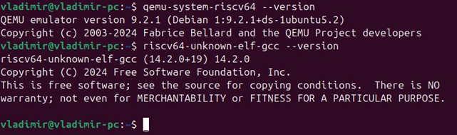

### 2.3. Установка Python-пакетов

> **! Для преподавателя:** эти пакеты отсутствуют в оригинальном хендбуке, но необходимы для сборки. Без них `ninja` завершается с ошибками. Подробнее — в [Приложении Б](#приложение-б-исправленные-баги).

```bash
pip install setuptools pyfdt ply libarchive-c pyelftools --break-system-packages
```

### 2.4. Установка repo (Google Repo Tool)

```bash
mkdir -p ~/.local/bin
curl https://storage.googleapis.com/git-repo-downloads/repo > ~/.local/bin/repo
chmod +x ~/.local/bin/repo
echo 'export PATH="$HOME/.local/bin:$PATH"' >> ~/.bashrc
source ~/.bashrc
repo --version
```

> Сообщение `<repo not installed>` в выводе — **нормально**. Это означает лишь что полный repo ещё не инициализирован, лаунчер работает корректно.

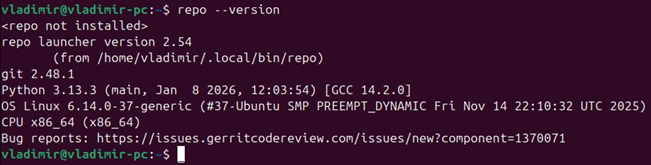

---

## 3. Часть I. Запуск seL4/sel4test на qemu-riscv-virt

### 3.1. Инициализация репозитория

```bash
mkdir -p ~/sel4-labs/lab2
cd ~/sel4-labs/lab2

git config --global user.email "you@example.com"
git config --global user.name "Your Name"

repo init -u https://github.com/seL4/sel4test-manifest.git -b refs/tags/13.0.0
```

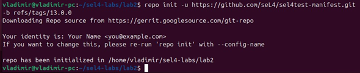

### 3.2. Получение исходного кода

```bash
repo sync
```

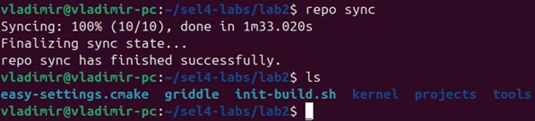

После синхронизации проверьте структуру:

```bash
ls
```

Ожидаемые элементы:

```
easy-settings.cmake  griddle  init-build.sh  kernel  projects  tools
```

> **! Для преподавателя:** структура каталога отличается от описанной в оригинальном хендбуке — отсутствуют `apps/`, `libs/`, `CMakeLists.txt`. Это нормально для версии 13.0.0, структура изменилась между релизами.

### 3.3. Конфигурирование сборки для riscv64

```bash
mkdir -p ~/sel4-labs/lab2/build-riscv64
cd ~/sel4-labs/lab2/build-riscv64

../init-build.sh -DPLATFORM=qemu-riscv-virt -DSIMULATION=1 -DKernelSel4Arch=riscv64
```

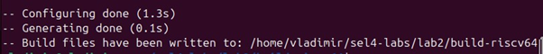

Параметры:

| Параметр | Значение | Описание |
|----------|----------|----------|
| `PLATFORM` | `qemu-riscv-virt` | CMake-имя платформы QEMU RISC-V virt |
| `SIMULATION` | `1` | Включение симуляционного режима и генерации скрипта `simulate` |
| `KernelSel4Arch` | `riscv64` | 64-битная архитектура ядра RISC-V |

Для проверки конфигурации:

```bash
cmake -LA . 2>/dev/null | grep -E "PLATFORM|KernelSel4Arch|SIMULATION|LibSel4TestPrinterRegex"
```

Ожидаемый вывод:

```
KernelSel4Arch:STRING=riscv64
LibSel4TestPrinterRegex:STRING=.*
PLATFORM:STRING=qemu-riscv-virt
SIMULATION:BOOL=ON
```

Также для конфигурации 

```bash
ccmake .
```

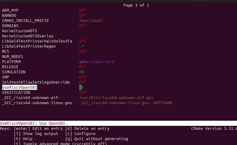

### 3.4. Сборка проекта

```bash
ninja
```

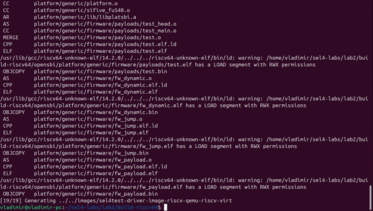

При успешной сборке:
- создаётся файл `simulate` в каталоге `build-riscv64`
- в подкаталоге `images/` формируются бинарные образы

```bash
ls
```

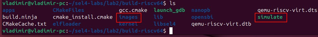

```bash
ls images/
```

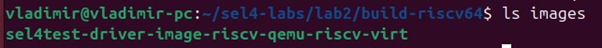

### 3.5. Запуск seL4/sel4test

```bash
cd ~/sel4-labs/lab2/build-riscv64
./simulate
```

Ожидаемый вывод в конце:

```
Test suite passed. 114 tests passed. 49 tests disabled.
All is well in the universe
```

Строка `All is well in the universe` — признак успешного прогона всех тестов.

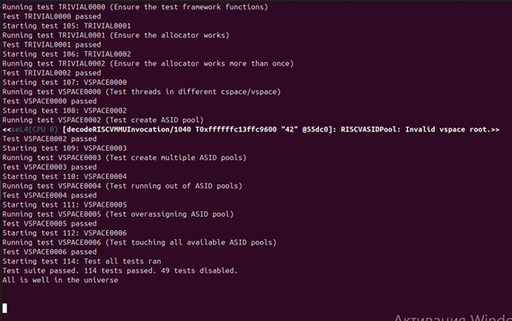

Завершение работы QEMU:
```
Ctrl-a, затем x
```

---

## 4. Часть II. Анализ конфигурации и артефактов сборки

### 4.1. Параметры CMake-конфигурации

В интерактивном режиме:

```bash
ccmake .
```

Или командой:

```bash
cd ~/sel4-labs/lab2/build-riscv64
cmake -LA . 2>/dev/null | grep -E "PLATFORM|KernelSel4Arch|SIMULATION|LibSel4TestPrinterRegex"
```

Зафиксированные значения:

| Переменная | Значение |
|-----------|----------|
| `PLATFORM` | `qemu-riscv-virt` |
| `KernelSel4Arch` | `riscv64` |
| `SIMULATION` | `ON` |
| `LibSel4TestPrinterRegex` | `.*` (все тесты) |

> `LibSel4TestPrinterRegex` задаёт POSIX-регулярное выражение для фильтрации запускаемых тестов.

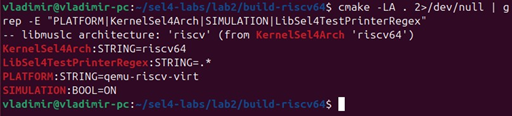

### 4.2. Скрипт `simulate`

```bash
sed -n '1,120p' ./simulate
```

Зафиксированные параметры запуска QEMU:

| Параметр | Значение |
|----------|----------|
| QEMU бинарник | `qemu-system-riscv64` |
| Машина | `-machine virt` |
| CPU | `-cpu rv64` |
| Память | `-m size=3072` |
| Образ | `images/sel4test-driver-image-riscv-qemu-riscv-virt` |
| Доп. параметры | `-bios none` |

### 4.3. Каталог `images/`

```bash
find images -maxdepth 1 -type f | sort
```

Вывод:

```
images/sel4test-driver-image-riscv-qemu-riscv-virt
```

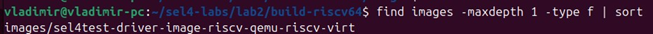

Один файл — совпадает с образом, используемым в скрипте `simulate`.

---

## 5. Часть III. Сравнительный эксперимент для riscv32

```bash
cd ~/sel4-labs/lab2
mkdir build-riscv32
cd build-riscv32
```

```bash
../init-build.sh -DPLATFORM=qemu-riscv-virt -DSIMULATION=1 -DKernelSel4Arch=riscv32
```

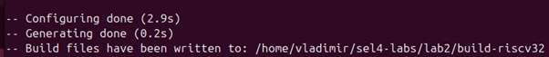

```bash
ninja
```

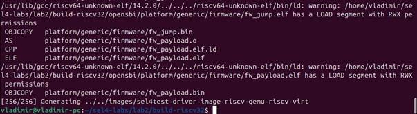

```bash
./simulate
```

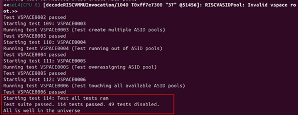

Проверка разрядности собранных бинарников:

```bash
file ~/sel4-labs/lab2/build-riscv32/images/sel4test-driver-image-riscv-qemu-riscv-virt
file ~/sel4-labs/lab2/build-riscv64/images/sel4test-driver-image-riscv-qemu-riscv-virt
```

Вывод:

```
...build-riscv32/images/...: ELF 32-bit LSB executable, UCB RISC-V, ...
...build-riscv64/images/...: ELF 64-bit LSB executable, UCB RISC-V, ...
```

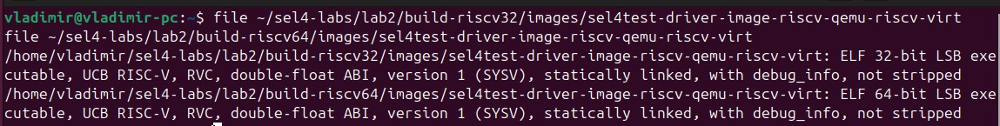

Сравнение результатов:

| | riscv64 | riscv32 |
|--|---------|---------|
| Сборка | ✅ успешно | ✅ успешно |
| Разрядность образа | ELF 64-bit | ELF 32-bit |
| Образ в `images/` | `sel4test-driver-image-riscv-qemu-riscv-virt` | `sel4test-driver-image-riscv-qemu-riscv-virt` |
| Тесты | 114 passed, 49 disabled | 114 passed, 49 disabled |
| Итог | All is well in the universe | All is well in the universe |

---

## 6. Часть IV. Фильтрация тестов sel4test

Установка фильтра через cmake:

```bash
cd ~/sel4-labs/lab2/build-riscv64
cmake -D LibSel4TestPrinterRegex="BIND.*" .
ccmake .
```

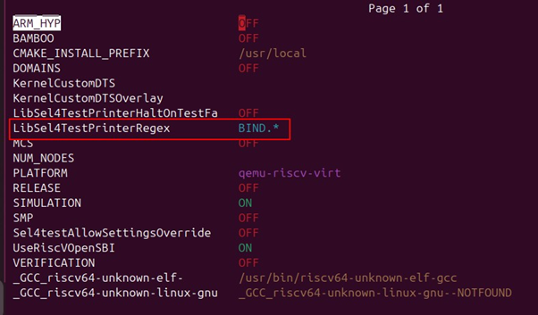

```bash
ninja
./simulate
```

Результаты с фильтром и без:

| | Без фильтра | С фильтром `BIND.*` |
|--|-------------|---------------------|
| Тестов выполнено | 114 | 6 |
| Тестов отключено | 49 | 2 |
| Итог | All is well in the universe | All is well in the universe |

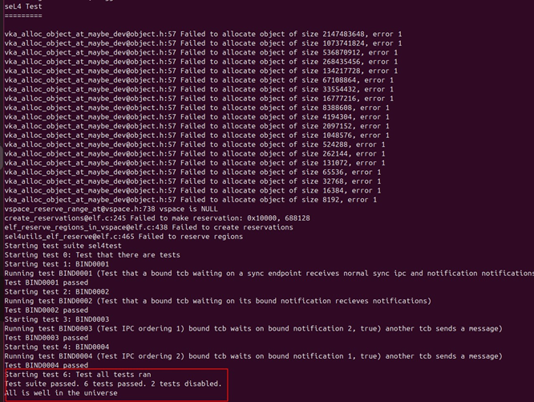

---

## 7. Часть V. Аналитическое исследование привилегий и CSR

### 7.1. Уровни привилегий RISC-V

В RISC-V определены три уровня привилегий:

- **M-mode (Machine mode)** — наивысший уровень, имеет полный доступ к железу, выполняется первым при старте. В QEMU virt его роль играет OpenSBI (прошивка).
- **S-mode (Supervisor mode)** — уровень ядра ОС, именно здесь работает seL4.
- **U-mode (User mode)** — наименьший уровень привилегий, здесь выполняются пользовательские процессы (в нашем случае — sel4test).

### 7.2. Поля MPP и SPP регистра mstatus

**`mstatus.MPP`** (биты 12:11) хранит предыдущий режим привилегий до входа в trap в M-mode. При выполнении `mret` процессор переходит в режим, закодированный в MPP, и сбрасывает MPP в U-mode. Именно так OpenSBI передаёт управление seL4: записывает `01` в MPP (S-mode), адрес seL4 в `mepc`, затем выполняет `mret`.

**`mstatus.SPP`** (бит 8) — аналогично для S-mode: хранит режим до trap в S-mode. При `sret` процессор переходит в режим из SPP. Так seL4 запускает пользовательские потоки: SPP = 0 (U-mode), адрес задачи в `sepc`, затем `sret`.

### 7.3. Регистры mcause и scause

`mcause` записывается аппаратно при любом trap в M-mode. Старший бит = 1 означает прерывание, = 0 — исключение. `scause` — аналог для S-mode.

Коды `ecall` по режиму:

| Источник `ecall` | Регистр | Код |
|-----------------|---------|-----|
| U-mode | `scause` | 8 |
| S-mode | `scause` / `mcause` | 9 |
| M-mode | `mcause` | 11 |

### 7.4. Регистры medeleg и mideleg

По умолчанию все trap-ы обрабатываются в M-mode. `medeleg` позволяет делегировать исключения в S-mode: если бит N установлен, исключение с кодом N обрабатывается в S-mode (через `stvec`, `sepc`, `scause`). `mideleg` — то же для прерываний. seL4 рассчитывает на то, что SBI настроил делегирование.

### 7.5. Схема пути привилегий

```
Старт QEMU → M-mode (OpenSBI)
  │  настраивает medeleg, mideleg
  │  записывает адрес seL4 в mepc, MPP=S-mode (01), выполняет mret
  ▼
S-mode (seL4 kernel)
  │  инициализирует память, объекты ядра
  │  записывает адрес задачи в sepc, SPP=U-mode (0), выполняет sret
  ▼
U-mode (sel4test)
  │  выполняет тесты
  │  системный вызов → ecall (scause=8)
  ▼
S-mode (seL4 обрабатывает syscall)
  │  sret
  ▼
U-mode (продолжение)
```

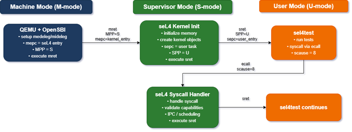

---

## 8. Часть VI. Bare-metal демо: инструментальное исследование CSR

Данная часть выполняется в **отдельном каталоге**, независимом от сборки seL4. Цель — на простом примере продемонстрировать чтение и изменение CSR при переходе M-mode → S-mode.

### 8.1. Структура проекта

```
~/sel4-labs/lab2-csr-demo/
  Makefile
  linker.ld
  start.S
  main.c
  uart.c
  uart.h
```

Создать каталог:

```bash
mkdir -p ~/sel4-labs/lab2-csr-demo
cd ~/sel4-labs/lab2-csr-demo
```

Содержимое файлов — в [Приложении А](#приложение-а-исходные-файлы-csr-demo).

### 8.2. Сборка и запуск

```bash
make clean
make
make run
```

### 8.3. Ожидаемый вывод

```
[M] m_mode_entry()
[M] mstatus = 0x0000000a00000000
[M] medeleg = 0x0000000000000000
[M] new medeleg = 0x0000000000000200
[M] -> switching to S-mode via mret

[S] s_mode_entry_c()
[S] sstatus = 0x0000000200000000
[S] stvec set
[S] triggering ecall from S-mode

[S] trap! scause = 0x0000000000000009  <- ecall from S-mode
[S] returned from trap handler. Done.
```

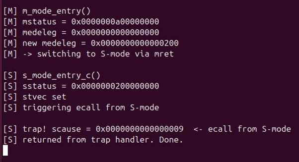

Завершение QEMU: `Ctrl-a, затем x`

### 8.4. Анализ значений CSR

#### Значения mstatus и medeleg до и после модификации в M-mode

| CSR | До | После | Интерпретация |
|-----|-----|-------|---------------|
| `mstatus` | `0x0000000a00000000` | — | MPP=10 (M-mode при старте) |
| `medeleg` | `0x0000000000000000` | `0x0000000000000200` | бит 9 установлен — ecall из S-mode делегирован |

#### Значение scause в обработчике trap

| CSR | Значение | Интерпретация |
|-----|----------|---------------|
| `scause` | `0x0000000000000009` | код 9 = `ecall from S-mode` (RISC-V Privileged ISA, таблица исключений) |

#### Механизм перехода M-mode → S-mode

1. В M-mode устанавливается `mstatus.MPP = 01` (S-mode) и `mepc = адрес s_mode_entry_c`
2. Выполняется `mret` — процессор переходит в режим из MPP (S-mode) и прыгает на адрес из `mepc`
3. В S-mode устанавливается `stvec = адрес обработчика trap`
4. Выполняется `ecall` — процессор сохраняет адрес следующей инструкции в `sepc`, записывает код в `scause = 9`, прыгает на `stvec`
5. Обработчик инкрементирует `sepc += 4` и выполняет `sret` — возврат в S-mode на следующую инструкцию

---

## 9. Требования к отчёту

В отчёте по лабораторной работе должны быть представлены:

1. Последовательность выполненных команд для основной части (получение seL4/sel4test, конфигурация, сборка, запуск `./simulate`).
2. Фрагменты вывода `./simulate`, подтверждающие успешный запуск и строка `All is well in the universe`.
3. Содержимое каталога `images/` и указание загрузочного образа.
4. Значения параметров `PLATFORM`, `KernelSel4Arch`, `SIMULATION`, `LibSel4TestPrinterRegex`.
5. Сравнение результатов для `riscv64` и `riscv32`.
6. Описание типичного пути привилегий M-mode → S-mode → U-mode и роли seL4 в этой схеме.
7. Для Приложения A — консольный вывод, значения CSR и их интерпретация (роль `mstatus`, `medeleg`, `scause` и механизм переходов между режимами).

---

## Приложение А. Исходные файлы csr-demo

### `linker.ld`

```ld
OUTPUT_ARCH(riscv)
ENTRY(_start)

MEMORY
{
  RAM (rwx) : ORIGIN = 0x80000000, LENGTH = 128M
}

SECTIONS
{
  . = ORIGIN(RAM);

  .text : {
    *(.text.entry)
    *(.text*)
  } > RAM

  .rodata : {
    *(.rodata*)
  } > RAM

  .data : {
    *(.data*)
  } > RAM

  .bss (NOLOAD) : {
    *(.bss*)
    *(COMMON)
  } > RAM

  _end = .;
}
```

### `uart.h`

```c
#ifndef UART_H
#define UART_H

#include <stdint.h>

void uart_putc(char c);
void uart_puts(const char *s);
void uart_put_hex64(uint64_t value);

#endif
```

### `uart.c`

```c
#include "uart.h"

#define UART0_BASE    0x10000000UL
#define UART0_THR     (UART0_BASE + 0x00)
#define UART0_LSR     (UART0_BASE + 0x05)
#define UART_LSR_THRE 0x20

static inline void mmio_write8(uintptr_t addr, uint8_t value) {
    *(volatile uint8_t *)addr = value;
}

static inline uint8_t mmio_read8(uintptr_t addr) {
    return *(volatile uint8_t *)addr;
}

void uart_putc(char c) {
    while (!(mmio_read8(UART0_LSR) & UART_LSR_THRE))
        ;
    mmio_write8(UART0_THR, (uint8_t)c);
}

void uart_puts(const char *s) {
    while (*s) {
        if (*s == '\n')
            uart_putc('\r');
        uart_putc(*s++);
    }
}

void uart_put_hex64(uint64_t value) {
    const char *hex = "0123456789abcdef";
    for (int i = 60; i >= 0; i -= 4) {
        uint8_t nibble = (value >> i) & 0xF;
        uart_putc(hex[nibble]);
    }
}
```

### `start.S`

```asm
    .section .text.entry
    .globl _start
    .extern s_mode_entry_c
_start:
    /* стек: _end + 4KB, выравнивание до 16 байт */
    la   sp, _end
    li   t0, 4096
    add  sp, sp, t0
    li   t0, ~15
    and  sp, sp, t0

    /* обработчик trap в M-mode для отладки */
    la   t0, m_trap_hang
    csrw mtvec, t0

    call m_mode_entry

    /* mepc = адрес точки входа S-mode */
    la   t2, s_mode_entry_c
    csrw mepc, t2

    /* настройка PMP: разрешаем S-mode доступ ко всей памяти */
    li   t0, 0x1f
    csrw pmpcfg0, t0
    li   t0, -1
    csrw pmpaddr0, t0

    /* mstatus.MPP = S-mode (01) */
    csrr t0, mstatus
    li   t1, 0x1800
    not  t1, t1
    and  t0, t0, t1
    li   t1, 0x0800
    or   t0, t0, t1
    csrw mstatus, t0

    mret

m_trap_hang:
    li   t0, 0x10000000
    li   t1, 0x45       /* 'E' */
    sb   t1, 0(t0)
    li   t1, 0x21       /* '!' */
    sb   t1, 0(t0)
1:  j 1b
```

### `main.c`

```c
#include <stdint.h>
#include "uart.h"

static inline uint64_t read_mstatus(void) {
    uint64_t v; __asm__ volatile ("csrr %0, mstatus" : "=r"(v)); return v;
}
static inline uint64_t read_medeleg(void) {
    uint64_t v; __asm__ volatile ("csrr %0, medeleg" : "=r"(v)); return v;
}
static inline uint64_t read_scause(void) {
    uint64_t v; __asm__ volatile ("csrr %0, scause"  : "=r"(v)); return v;
}
static inline uint64_t read_sstatus(void) {
    uint64_t v; __asm__ volatile ("csrr %0, sstatus" : "=r"(v)); return v;
}

/* Обработчик trap в S-mode — только asm, никакого C внутри naked */
__attribute__((naked)) void s_trap_entry(void) {
    __asm__ volatile (
        "addi sp, sp, -16\n"
        "sd   ra, 8(sp)\n"
        "call s_trap_handler\n"
        "ld   ra, 8(sp)\n"
        "addi sp, sp, 16\n"
        "sret\n"
    );
}

void s_trap_handler(void) {
    /* продвигаем sepc на следующую инструкцию после ecall */
    uint64_t sepc;
    __asm__ volatile ("csrr %0, sepc" : "=r"(sepc));
    sepc += 4;
    __asm__ volatile ("csrw sepc, %0" :: "r"(sepc));

    uint64_t sc = read_scause();
    uart_puts("\n[S] trap! scause = 0x");
    uart_put_hex64(sc);
    if (sc == 9)
        uart_puts("  <- ecall from S-mode\n");
    else
        uart_puts("\n");
}

void m_mode_entry(void) {
    uart_puts("\n[M] m_mode_entry()\n");

    uint64_t ms = read_mstatus();
    uint64_t md = read_medeleg();

    uart_puts("[M] mstatus = 0x"); uart_put_hex64(ms); uart_puts("\n");
    uart_puts("[M] medeleg = 0x"); uart_put_hex64(md); uart_puts("\n");

    /* делегируем ecall из S-mode (бит 9) в S-mode */
    uint64_t new_md = md | (1ULL << 9);
    __asm__ volatile ("csrw medeleg, %0" :: "r"(new_md));
    uart_puts("[M] new medeleg = 0x"); uart_put_hex64(new_md); uart_puts("\n");

    uart_puts("[M] -> switching to S-mode via mret\n");
}

void s_mode_entry_c(void) {
    uart_puts("\n[S] s_mode_entry_c()\n");

    uint64_t ss = read_sstatus();
    uart_puts("[S] sstatus = 0x"); uart_put_hex64(ss); uart_puts("\n");

    /* устанавливаем обработчик trap */
    uintptr_t handler = (uintptr_t)s_trap_entry;
    __asm__ volatile ("csrw stvec, %0" :: "r"(handler));
    uart_puts("[S] stvec set\n");

    uart_puts("[S] triggering ecall from S-mode\n");
    __asm__ volatile ("ecall");

    uart_puts("[S] returned from trap handler. Done.\n");
}
```

### `Makefile`

```makefile
CROSS_PREFIX ?= riscv64-unknown-elf-
CC      := $(CROSS_PREFIX)gcc
AS      := $(CROSS_PREFIX)gcc
OBJCOPY := $(CROSS_PREFIX)objcopy

CFLAGS  := -march=rv64imac_zicsr -mabi=lp64 -mcmodel=medany \
           -O2 -Wall -ffreestanding -nostdlib -nostartfiles
LDFLAGS := -T linker.ld -nostdlib

SRCS_C  := main.c uart.c
SRCS_S  := start.S
OBJS    := $(SRCS_C:.c=.o) $(SRCS_S:.S=.o)

TARGET  := csr-demo.elf
BIN     := csr-demo.bin

all: $(BIN)

%.o: %.c
	$(CC) $(CFLAGS) -c $< -o $@

%.o: %.S
	$(AS) $(CFLAGS) -c $< -o $@

$(TARGET): $(OBJS) linker.ld
	$(CC) $(CFLAGS) $(OBJS) -o $@ $(LDFLAGS)

$(BIN): $(TARGET)
	$(OBJCOPY) -O binary $< $@

run: $(BIN)
	qemu-system-riscv64 -M virt -nographic -bios none -kernel $(BIN)

clean:
	rm -f $(OBJS) $(TARGET) $(BIN)
```

---

## Приложение Б. Исправленные баги

> **! Для преподавателя:** в процессе проверки лабораторной работы выявлены и исправлены следующие баги оригинального хендбука.

---

### Баг 1. Отсутствующие зависимости в разделе установки

**Файл:** раздел «Оборудование и программные средства»

**Проблема:** в оригинальном хендбуке отсутствует ряд пакетов, без которых сборка завершается с ошибками. Ниже — полный список недостающих зависимостей и соответствующие ошибки:

| Пакет | Ошибка без него |
|-------|----------------|
| `device-tree-compiler` | `Failed to create DTS from QEMU's DTB` |
| `python3-protobuf` | `Could not import the Google protobuf Python libraries` |
| `protobuf-compiler` | `FileNotFoundError: No such file or directory: 'protoc'` |
| `libxml2-utils` | `xmllint: command not found` |
| `libarchive-dev` | `ModuleNotFoundError: No module named 'libarchive'` |
| `setuptools` (pip) | `ImportError: cannot import name 'setup' from 'setuptools'` |
| `pyfdt` (pip) | `ModuleNotFoundError: No module named 'pyfdt'` |
| `ply` (pip) | `ModuleNotFoundError: No module named 'ply'` |
| `libarchive-c` (pip) | `ModuleNotFoundError: No module named 'libarchive'` |
| `pyelftools` (pip) | `ModuleNotFoundError: No module named 'elftools'` |

**Исправление:** все недостающие пакеты добавлены в раздел 2 («Подготовка окружения»).

---

### Баг 2. `naked` функция с C-кодом внутри

**Файл:** `main.c`

**Проблема:** атрибут `naked` означает что компилятор не генерирует пролог/эпилог функции. Смешивать C-код с `naked` — undefined behavior, поведение непредсказуемо.

**Было:**
```c
void s_trap(void) __attribute__((naked));
void s_trap(void) {
    __asm__ volatile ("addi sp, sp, -16\n" ...);
    uint64_t sc = read_scause();   // ← UB! C-код в naked функции
    uart_puts(...);
    __asm__ volatile ("sret\n");
}
```

**Стало** (разделили на две функции):
```c
// только asm — голый обработчик входа
__attribute__((naked)) void s_trap_entry(void) {
    __asm__ volatile (
        "addi sp, sp, -16\n"
        "sd   ra, 8(sp)\n"
        "call s_trap_handler\n"
        "ld   ra, 8(sp)\n"
        "addi sp, sp, 16\n"
        "sret\n"
    );
}

// нормальная C-функция
void s_trap_handler(void) {
    uint64_t sc = read_scause();
    uart_puts(...);
}
```

---

### Баг 3. Стек указывает на `_end` без отступа

**Файл:** `start.S`

**Проблема:** `_end` — конец секции BSS. Стек растёт вниз, и без отступа сразу затирает данные программы.

**Было:**
```asm
la   sp, _end
```

**Стало:**
```asm
la   sp, _end
li   t0, 4096
add  sp, sp, t0    /* отступ 4KB выше _end */
li   t0, ~15
and  sp, sp, t0    /* выравнивание до 16 байт */
```

---

### Баг 4. Неверный бит в `medeleg`

**Файл:** `main.c`

**Проблема:** в демо выполняется `ecall` из S-mode (код исключения 9), однако оригинальный код устанавливает бит 8, который делегирует `ecall` из U-mode (код 8).

**Было:**
```c
uint64_t new_md = md | (1ULL << 8);  // бит 8 = ecall из U-mode
```

**Стало:**
```c
uint64_t new_md = md | (1ULL << 9);  // бит 9 = ecall из S-mode
```

---

### Баг 5. Отсутствие расширения `zicsr` в `-march`

**Файл:** `Makefile`

**Проблема:** GCC 14+ требует явного указания расширения `zicsr` для CSR-инструкций (`csrr`, `csrw` и др.).

**Ошибка:**
```
Error: unrecognized opcode `csrr s0,mstatus', extension `zicsr' required
```

**Было:**
```makefile
CFLAGS := -march=rv64imac -mabi=lp64 ...
```

**Стало:**
```makefile
CFLAGS := -march=rv64imac_zicsr -mabi=lp64 ...
```

---

### Баг 6. Отсутствие `-mcmodel=medany`

**Файл:** `Makefile`

**Проблема:** без `-mcmodel=medany` компилятор использует модель `medlow` (диапазон ±2GB от нуля). При загрузке с `0x80000000` строковые литералы оказываются вне досягаемости.

**Ошибка:**
```
relocation truncated to fit: R_RISCV_HI20 against `.LC0'
```

**Было:**
```makefile
CFLAGS := -march=rv64imac_zicsr -mabi=lp64 ...
```

**Стало:**
```makefile
CFLAGS := -march=rv64imac_zicsr -mabi=lp64 -mcmodel=medany ...
```

---

### Баг 7. PMP не настроен — S-mode не имеет доступа к памяти

**Файл:** `start.S`

**Проблема:** в RISC-V Physical Memory Protection (PMP) по умолчанию запрещает S-mode и U-mode доступ к любой памяти. Без явной настройки PMP в M-mode после `mret` любое обращение к памяти в S-mode вызывает `Instruction access fault` (`mcause = 1`).

**Было:** настройка PMP отсутствует.

**Стало** (добавлено перед `mret`):
```asm
/* разрешаем S-mode доступ ко всей памяти через PMP */
li   t0, 0x1f       /* RWX + A=NAPOT */
csrw pmpcfg0, t0
li   t0, -1         /* адрес = вся память */
csrw pmpaddr0, t0
```

---

### Баг 8. `sepc` не инкрементируется — бесконечный цикл trap

**Файл:** `main.c`

**Проблема:** после обработки trap через `sret` процессор возвращается на адрес в `sepc`, который указывает на ту же инструкцию `ecall`. Результат — бесконечный цикл: trap → handler → sret → trap.

**Было:** в `s_trap_handler` нет инкремента `sepc`.

**Стало:**
```c
void s_trap_handler(void) {
    /* продвигаем sepc на следующую инструкцию */
    uint64_t sepc;
    __asm__ volatile ("csrr %0, sepc" : "=r"(sepc));
    sepc += 4;
    __asm__ volatile ("csrw sepc, %0" :: "r"(sepc));
    // ... остальной код
}
```
